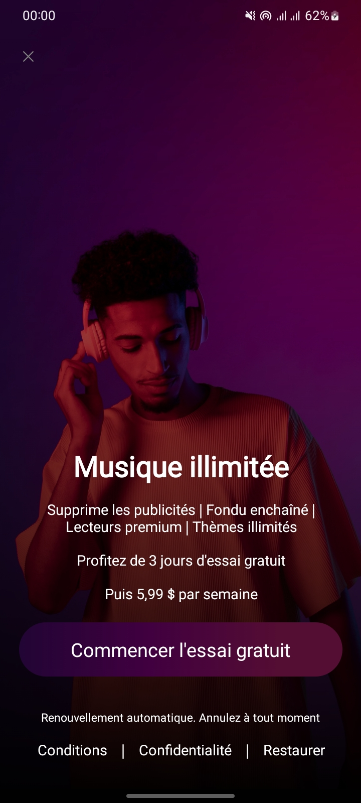

# 🎶 Music Unlimited

Bienvenue sur _Music Unlimited, une application de streaming musical moderne. Ce projet est actuellement en développement et propose une première version de la \*\*page d'accueil_. Le reste des fonctionnalités sera ajouté dans les prochaines mises à jour.

## 🌟 Aperçu

La page d'accueil met en avant :

- Une interface utilisateur élégante et intuitive.
- La possibilité de profiter d'un _essai gratuit de 3 jours, suivi d'un abonnement à \*\*5,99 $ par semaine_.
- Un accès rapide aux conditions, à la politique de confidentialité, et aux options de restauration.

  
(Ajoutez une capture d'écran ici si possible)

## 🛠 Technologies utilisées

- _Frontend_ : HTML, CSS
- _Design_ : Inspiré de plateformes modernes de streaming musical
- _Backend_ : Non encore implémenté

## 📈 Roadmap

Voici les fonctionnalités prévues pour les prochaines étapes :

1. _Catalogue musical_ : Accédez à une large collection de chansons.
2. _Création de playlists_ : Enregistrez et organisez vos morceaux préférés.
3. _Mode hors ligne_ : Écoutez votre musique sans connexion Internet.
4. _Effets audio interactifs_ : Ajout de fondu enchaîné, égaliseur, etc.
5. _Intégration des paiements_ : Prise en charge des solutions locales et internationales.
